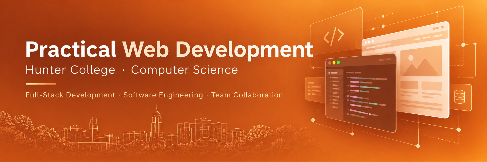

# Practical Web Development

**Hunter College · Computer Science**

A hands-on, project-based course in modern full-stack web development, software engineering practices, and collaborative development.

---

## Course Overview

Practical Web Development introduces students to the technologies, tools, and development practices used to build modern web applications.

Through individual assignments, guided exercises, demonstrations, and a team-based final project, students gain experience developing software across the full web application stack. The course emphasizes not only implementation, but also source control, collaboration, software development workflow, problem solving, and professional development practices.

Students build projects for their portfolios while developing technical and professional skills that support careers in software development and related technology fields.

## Technology and Development Topics

The course covers:

- Software Development Life Cycle (SDLC) and development methodologies, including Waterfall and Agile
- Git and GitHub for source control and team collaboration
- JavaScript, HTML, and Document Object Model (DOM) manipulation
- React
- React Router and client-side routing in Single-Page Applications (SPAs)
- Asynchronous JavaScript and external API requests
- Redux and Thunk middleware
- Node.js
- Express and RESTful APIs
- PostgreSQL
- Sequelize Object-Relational Mapping (ORM)
- Full-stack application architecture and integration
- Testing, debugging, and deployment practices

## Learning Objectives

By the end of the course, students should be able to demonstrate proficiency in the following areas.

### Technical Knowledge and Skills

- Build full-stack web applications that integrate frontend and backend components
- Apply modern web development technologies, including React, Node.js, Express, and PostgreSQL
- Design and implement RESTful APIs
- Create and use relational databases for storing, retrieving, and managing application data
- Manage source code and collaborate with other developers using Git and GitHub
- Use modern software development tools to develop, test, debug, and maintain web applications

### Career Readiness Competencies

- **Career & Self-Development and Technology:** Learn and apply new technologies, tools, and development practices
- **Communication:** Communicate technical ideas and project information clearly and in an organized manner
- **Critical Thinking:** Analyze problems and make decisions using sound reasoning and judgment
- **Teamwork, Equity & Inclusion:** Work effectively and respectfully with others toward shared project goals
- **Leadership:** Plan, initiate, manage, complete, and evaluate software projects
- **Professionalism:** Deliver high-quality assignments and projects on time and demonstrate responsible professional practices

## Course Projects

The course progresses from focused frontend assignments to a full-stack final project.

| Project | Focus |
|---|---|
| **Assignment 1 — Zoo** | JavaScript fundamentals and application structure |
| **Assignment 2 — Grid Maker** | DOM manipulation and event-driven interaction |
| **Assignment 3 — Bank of React** | React, routing, application state, and API-driven development |
| **Final Project — Full-Stack CRUD Application** | React frontend, Node.js/Express backend, RESTful APIs, PostgreSQL, and Sequelize |

### Public Starter Code

- [Zoo Starter Code](https://github.com/johnnylaicode/zoo-starter-code)
- [Grid Maker Starter Code](https://github.com/johnnylaicode/grid-maker-starter-code)
- [Bank of React Starter Code](https://github.com/johnnylaicode/bank-of-react-starter-code)
- [Final Project Client Starter Code](https://github.com/johnnylaicode/client-starter-code)
- [Final Project Server Starter Code](https://github.com/johnnylaicode/server-starter-code)

## Course Roadmap

### Class 1 — Course Foundations, SDLC, Git, and GitHub

**Topics**
- Course overview and logistics
- Introduction to full-stack web development
- Software Development Life Cycle (SDLC)
- Waterfall and Agile development
- Git and GitHub
- SSH keys
- Git feature branch workflow
- Team repositories
- GitHub Pages deployment

**Demonstrations**
- Create a simple website repository and deploy it with GitHub Pages
- Set up SSH keys for Git and GitHub
- Work with the Git feature branch workflow using [feature-website](https://github.com/johnnylaicode/feature-website)
- Set up a shared team repository

**Resources**
- [What Is SDLC? — AWS](https://aws.amazon.com/what-is/sdlc/)
- [What is Agile? — Atlassian](https://www.atlassian.com/agile)
- [Examples of Epic, User Story, and Acceptance Criteria](https://tech.gsa.gov/guides/user_story_example/)
- [Writing Effective User Stories](https://tech.gsa.gov/guides/effective_user_stories/)
- [Git Feature Branch Workflow](https://www.atlassian.com/git/tutorials/comparing-workflows/feature-branch-workflow)
- [Pro Git Book](https://git-scm.com/book/en/v2)
- [Git Reference Manual](https://git-scm.com/docs/)
- [GitHub Git Cheat Sheet](https://training.github.com/downloads/github-git-cheat-sheet/)
- [GitHub SSH Documentation](https://docs.github.com/en/authentication/connecting-to-github-with-ssh)
- [GitHub Pages Quickstart](https://docs.github.com/en/pages/quickstart)
- [HTML Tutorial](https://www.w3schools.com/html/default.asp)
- [CSS Tutorial](https://www.w3schools.com/css/default.asp)

### Class 2 — JavaScript Fundamentals

**Topics**
- Introduction to Assignment 1: Zoo
- JavaScript fundamentals
- Functions, scope, function values, arrow functions, and side effects
- Node.js setup

**Resources**
- [Zoo Starter Code](https://github.com/johnnylaicode/zoo-starter-code)
- [Eloquent JavaScript — Chapter 3: Functions](http://eloquentjavascript.net/03_functions.html)
- [Download Node.js](https://nodejs.org/en/download/)
- [JavaScript Crash Course](https://www.youtube.com/watch?v=hdI2bqOjy3c&ab_channel=TraversyMedia)
- DOM preparation:
  - [Introduction to the DOM](https://www.youtube.com/watch?v=l-0nPnSvbX8)
  - [Traversing the DOM](https://www.youtube.com/watch?v=8LWQNnVAMh4)
  - [DOM Events](https://www.youtube.com/watch?v=QE1YQnhntgw)

### Class 3 — JavaScript Objects, Arrays, and Higher-Order Functions

**Topics**
- Objects and arrays
- Mutability
- Array operations
- Strings
- Rest parameters
- JSON
- Higher-order functions
- `map` and `reduce`

**Resources**
- [Eloquent JavaScript — Chapter 4: Objects and Arrays](http://eloquentjavascript.net/04_data.html)
- [Eloquent JavaScript — Chapter 5: Higher-Order Functions](http://eloquentjavascript.net/05_higher_order.html)

### Class 4 — Document Object Model (DOM)

**Topics**
- DOM concepts
- DOM traversal and manipulation
- Event-driven browser interaction
- Introduction to Assignment 2: Grid Maker

**Demonstrations**
- [DOM Examples](https://github.com/johnnylaicode/dom-examples)
- [DOM Manipulation Example](https://gist.github.com/johnnylaicode/c8689ffee1f5fe516dec769d9bda1581)
- Grid Maker application

**Resources**
- [Grid Maker Starter Code](https://github.com/johnnylaicode/grid-maker-starter-code)
- [MDN: Introduction to the DOM](https://developer.mozilla.org/en-US/docs/Web/API/Document_Object_Model/Introduction)
- [Eloquent JavaScript — Chapter 13: JavaScript and the Browser](http://eloquentjavascript.net/13_browser.html)
- [Eloquent JavaScript — Chapter 14: The Document Object Model](http://eloquentjavascript.net/14_dom.html)
- [Eloquent JavaScript — Chapter 15: Handling Events](http://eloquentjavascript.net/15_event.html)

### Class 5 — Introduction to React

**Topics**
- React application structure
- JSX
- Rendering elements
- Components and props
- State
- Data flow
- Node.js, NPM, NPX, and NVM

**Demonstration**
- Build a simple React "Hello World" application

**Resources**
- [React Documentation](https://react.dev/)
- [Introduction to React Video Series](https://www.youtube.com/watch?v=FRjlF74_EZk&list=PLruo2gSoqleiMVEIqmvZkIpFEN_TPt0hR)

### Class 6 — React Components, Asynchronous Programming, and APIs

**Topics**
- React components
- Component state and data flow
- Asynchronous JavaScript
- `async` / `await`
- External API requests

**Demonstrations**
- [React Application Examples](https://github.com/johnnylaicode/react-examples)
  - FolderComponent
  - TextAreaComponent
  - FormComponent
  - ApiDataComponent
  - SearchComponent

**Resources**
- [React Documentation](https://react.dev/)
- [React Developer Tools](https://chrome.google.com/webstore/detail/react-developer-tools/fmkadmapgofadopljbjfkapdkoienihi?hl=en)
- [Async JavaScript Crash Course](https://www.youtube.com/watch?v=PoRJizFvM7s&ab_channel=TraversyMedia)

### Class 7 — React Router and Single-Page Applications

**Topics**
- Single-Page Applications (SPAs)
- Client-side routing
- React Router
- Introduction to Assignment 3: Bank of React
- API-driven React applications

**Resources**
- [Bank of React Starter Code](https://github.com/johnnylaicode/bank-of-react-starter-code)
- [JavaScript.info: Promises, async/await, and asynchronous JavaScript](https://javascript.info/async)
- [Eloquent JavaScript — Asynchronous Programming](https://eloquentjavascript.net/11_async.html)
- [MDN: Fetch API](https://developer.mozilla.org/en-US/docs/Web/API/Fetch_API)
- [MDN: Promise](https://developer.mozilla.org/en-US/docs/Web/JavaScript/Reference/Global_Objects/Promise)
- [HTTP Crash Course](https://www.youtube.com/watch?v=iYM2zFP3Zn0)

### Class 8 — Redux and Thunk Middleware

**Topics**
- Application state management
- Redux
- Thunk middleware
- Asynchronous state updates

**Demonstrations**
- [React Ticking Clock](https://github.com/johnnylaicode/react-ticking-clock-app)
- [React Redux Ticking Clock](https://github.com/johnnylaicode/react-redux-ticking-clock-app)
- [React Application Examples](https://github.com/johnnylaicode/react-examples)

**Resources**
- [Fundamentals of Redux — Dan Abramov](https://egghead.io/courses/fundamentals-of-redux-course-from-dan-abramov-bd5cc867)
- [Building React Applications with Idiomatic Redux — Dan Abramov](https://egghead.io/courses/building-react-applications-with-idiomatic-redux)
- [Thunks in Redux: The Basics](https://medium.com/fullstack-academy/thunks-in-redux-the-basics-85e538a3fe60)

### Class 9 — Final Project: Frontend Development

**Topics**
- Introduction to the full-stack final project
- Full-stack CRUD application architecture
- Frontend application structure
- React client development

**Resources**
- [Final Project Client Starter Code](https://github.com/johnnylaicode/client-starter-code)
- [Final Project Server Starter Code](https://github.com/johnnylaicode/server-starter-code)
- [What's a CRUD Application?](https://medium.com/geekculture/whats-a-crud-app-e5a29cce03b5)

### Class 10 — Final Project: Backend Development, REST APIs, and Databases

**Topics**
- Backend application development
- Node.js and Express
- RESTful APIs
- PostgreSQL
- Object-Relational Mapping (ORM)
- Sequelize
- API testing with Postman

**Demonstrations**
- Run the backend starter application
- Build and test RESTful API routes
- [Express Routing Examples](https://github.com/johnnylaicode/express-routing)

**Resources**
- [PostgreSQL](https://www.postgresql.org/download/)
- [Postman](https://www.postman.com/downloads/)
- [Relational Database Concepts](https://www.youtube.com/watch?v=NvrpuBAMddw)
- [Introduction to Object-Relational Mapping](https://www.youtube.com/watch?v=dHQ-I7kr_SY)
- [Sequelize Documentation](https://sequelize.org/)

### Class 11 — Final Project: Backend Development

**Topics**
- Continue backend development
- Server-side application structure
- Source control and repository integration

**Resources**
- [Final Project Server Starter Code](https://github.com/johnnylaicode/server-starter-code)
- [Add an Existing Project to GitHub](https://docs.github.com/en/migrations/importing-source-code/using-the-command-line-to-import-source-code/adding-locally-hosted-code-to-github)

### Class 12 — Final Project: Integration

**Topics**
- Connect frontend and backend application routes
- PostgreSQL command-line workflow
- Full-stack integration and debugging

**Resources**
- [Final Project Client Starter Code](https://github.com/johnnylaicode/client-starter-code)
- [Final Project Server Starter Code](https://github.com/johnnylaicode/server-starter-code)
- [psql Commands](https://www.postgresqltutorial.com/postgresql-administration/psql-commands/)

### Class 13 — Final Project Development

Students continue implementation, integration, testing, debugging, and refinement of the full-stack CRUD application.

### Class 14 — Course Assessment

- Course assessment
- Review of core full-stack development concepts and practices

## Development Philosophy

The course emphasizes learning by building. Students move from foundational JavaScript and browser programming to component-based frontend development, state management, backend APIs, relational databases, and full-stack integration.

Git and GitHub are used throughout the course so that source control and collaborative development are part of the development process rather than separate topics.

## About This Repository

This repository provides a public overview of the **Practical Web Development** course and links to selected public examples, starter repositories, and learning resources used in the course.

Some instructional materials, assignments, slides, and course documents used with enrolled students are not included in this public repository.
